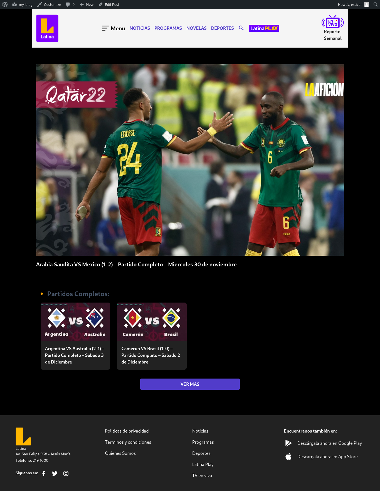

## **Overview**

This theme wordpress is created by results a challenge, this project use **Tailwind CSS, HTML, CSS & PHP**. The S.O use was **Fedora 38**.

## **Setup**

We tell you about the setup that you need

> * Node.js
> * npm
> * tailwind css

### **Install Node.js & npm**

> [Link to Download Node](https://nodejs.org/en)

If you wanna verify the installation 

```bash
node --version
```

```bash
npm --version
```

### **Install Tailwind CSS**

In this case we use the following command to install tailwind css:

```bash
npm install tailwindcss --save-dev
```

After the installation, create file **tailwind.css** and put the following:

```css
/*!
    Theme Name: WordPress + Tailwind
*/

@tailwind base;
@tailwind components;
@tailwind utilities;
```

Now, create file **tailwind.config.js** and put:

```javascript
module.exports = {
  content: ["./**/*.php"],
  theme: {
    extend: {},
  },
  plugins: [],
}
```

Then, you need run the following code by generate a static file css **style.css**

```css
npx tailwindcss -i ./tailwind.css -o ./style.css
```

With this steps you can use the template.

## **Views**

### Home


### Post
